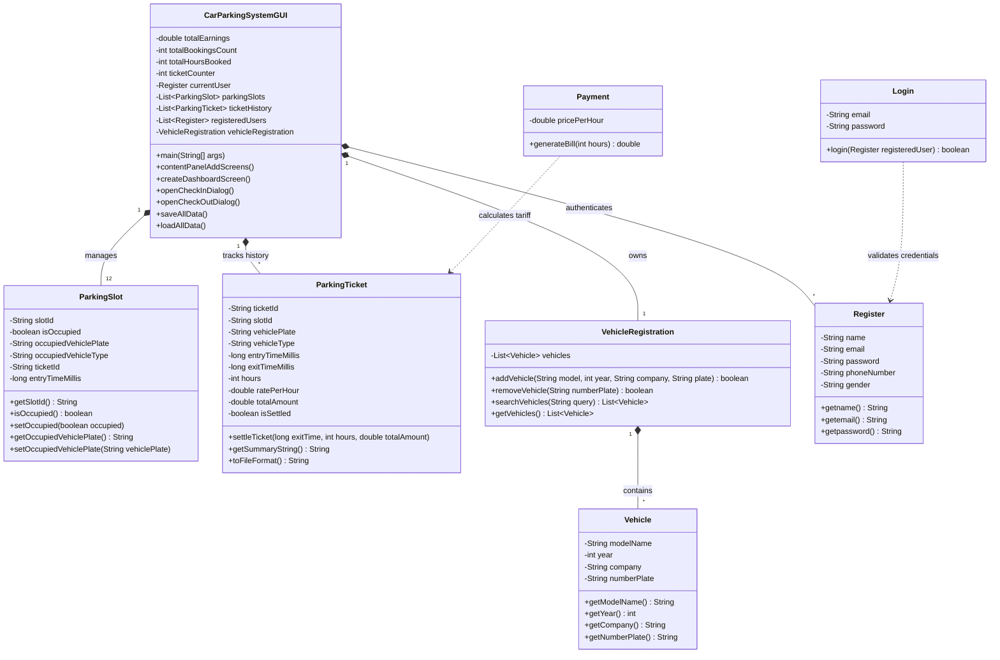
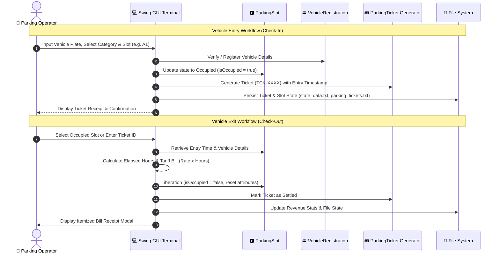
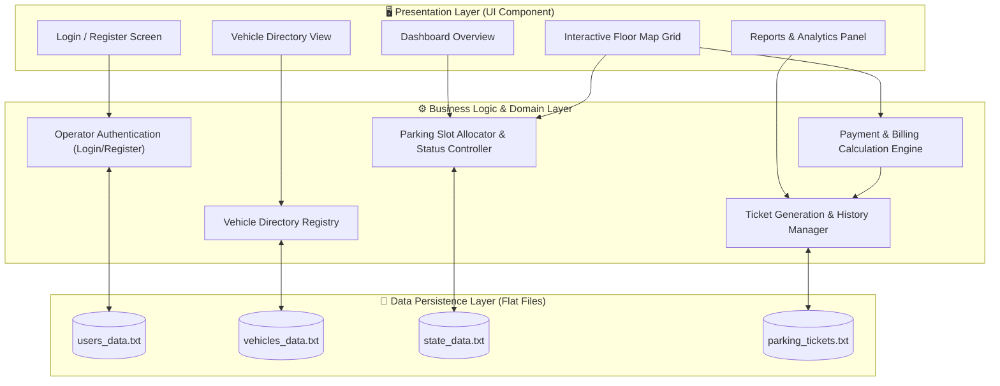
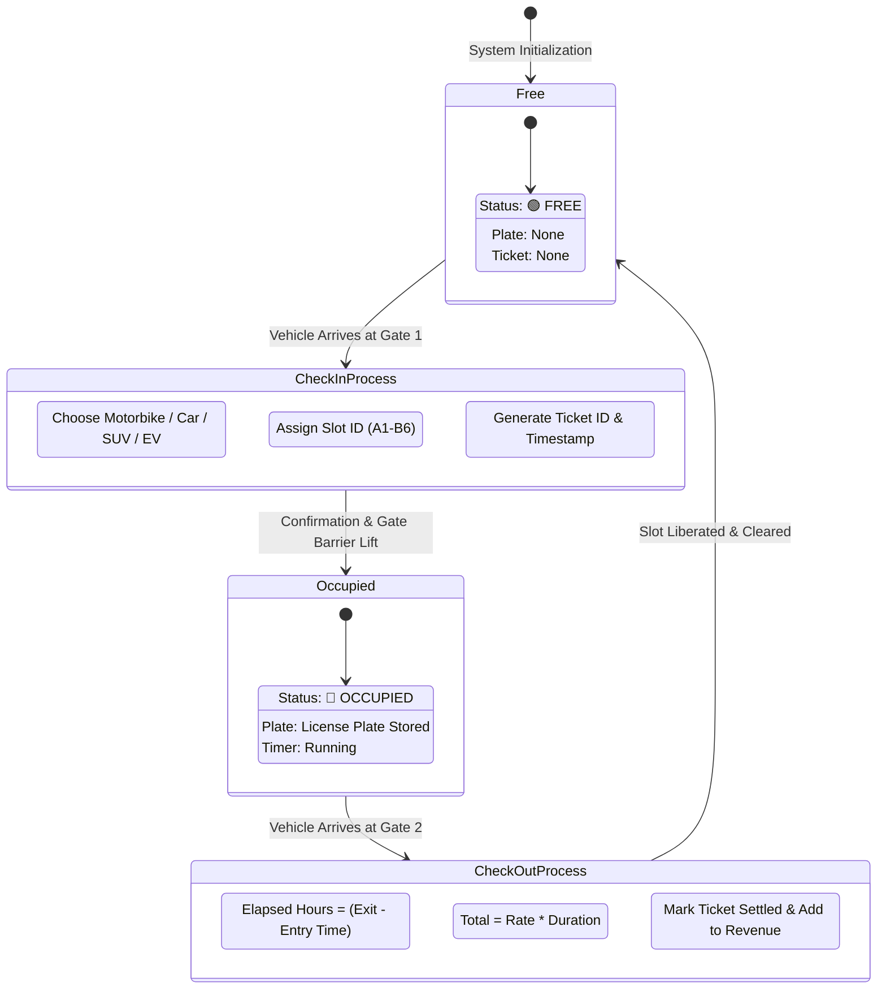

# 🚗 Smart Car Parking Management System

[](https://www.oracle.com/java/)
[](https://docs.oracle.com/javase/tutorial/uiswing/)
[](https://en.wikipedia.org/wiki/Object-oriented_programming)
[](LICENSE)

A state-of-the-art **Desktop Car Parking Management System** built with **Java Swing** and **Object-Oriented Programming (OOP)** principles. Featuring a modern slate & royal blue dark-themed dashboard, real-world gate entry/exit workflows, dynamic floor slot mapping, tariff billing calculations, operator authentication, search lookup, reports & analytics, and persistent flat-file storage.

---

## 📋 Table of Contents
- [✨ Key Features](#-key-features)
- [📐 System Architecture & Diagrams](#-system-architecture--diagrams)
  - [1. Class Diagram (UML)](#1-class-diagram-uml)
  - [2. Vehicle Check-In & Check-Out Flow (Sequence)](#2-vehicle-check-in--check-out-flow-sequence)
  - [3. System Layer Architecture & Data Flow](#3-system-layer-architecture--data-flow)
  - [4. Parking Slot Lifecycle (State Machine)](#4-parking-slot-lifecycle-state-machine)
- [💡 OOP Design Principles Applied](#-oop-design-principles-applied)
- [💵 Hourly Tariff Structure](#-hourly-tariff-structure)
- [🗂️ File Storage & Data Persistence](#️-file-storage--data-persistence)
- [📂 Project Directory Structure](#-project-directory-structure)
- [🚀 Getting Started](#-getting-started)
  - [Prerequisites](#prerequisites)
  - [Compilation & Execution](#compilation--execution)
- [📱 User Interface Highlights](#-user-interface-highlights)

---

## ✨ Key Features

- 🔐 **Operator Authentication**:
  - Secure login & operator registration system.
  - Session tracking with operator profile details.
  - Multi-user credentials persisted to `users_data.txt`.

- 📊 **Interactive Dashboard Overview**:
  - Real-time KPI counter cards: Available Slots, Occupied Slots, Total Revenue (PKR), and Total Bookings.
  - Quick action buttons for Gate Operations & Terminal Search.
  - Visual tariff summary.

- 🗺️ **Visual Floor Map (Slot Grid)**:
  - Interactive grid layout displaying real-time occupancy status (`A1`-`A6`, `B1`-`B6`).
  - Color-coded indicator buttons (🟢 **Emerald Free**, 🔴 **Rose Red Occupied**).
  - Single-click action for fast Check-In or Check-Out.

- 🛃 **Vehicle Entry Gate (Check-In)**:
  - Multi-vehicle category support (*Motorbike, Car/Sedan, SUV/Heavy, EV Station*).
  - Auto-slot assignment or manual floor slot selection.
  - Instant ticket generation (`TCK-XXXX`) with entry timestamping.

- 🏁 **Vehicle Exit Gate (Check-Out & Settlement)**:
  - Automatic parking duration calculation (billed per hour).
  - Tariff rate application based on vehicle classification.
  - Slot liberation back to the available parking pool.
  - Printable itemized receipt display window.

- 🚘 **Vehicle Directory Management**:
  - Register new vehicles with details (*Model Name, Year, Manufacturer Company, License Plate*).
  - Real-time search, filter, and removal capabilities.
  - Persistent storage in `vehicles_data.txt`.

- 🔍 **Search & Lookup Terminal**:
  - Search active vehicles and ticket history instantly by Ticket ID, Plate Number, or Slot ID.

- 📈 **Reports & System Analytics**:
  - Financial earnings total breakdown.
  - Total parking hours served and occupancy ratios.
  - Full audit log history for settled and active tickets.

---

## 📐 System Architecture & Diagrams

### 1. Class Diagram (UML)

The system adheres strictly to Object-Oriented design principles. Below is the UML class diagram illustrating core domain entities, GUI components, and their relationships:



---

### 2. Vehicle Check-In & Check-Out Flow (Sequence)

This sequence diagram depicts the end-to-end operational workflow when a vehicle enters and exits the facility:



---

### 3. System Layer Architecture & Data Flow

High-level architecture view showcasing component separation into Presentation Layer, Business Logic Layer, and Storage Layer:



---

### 4. Parking Slot Lifecycle (State Machine)

State diagram showing all possible state transitions for any individual parking slot:



---

## 💡 OOP Design Principles Applied

This project is built to demonstrate clean Object-Oriented Programming principles in Java:

1. **Encapsulation**:
   - Class properties (e.g., `isOccupied`, `ticketId`, `numberPlate`, `password`) are strictly `private`.
   - Controlled access via clean public getter and setter methods.

2. **Abstraction**:
   - Complex details such as file parsing, timestamp conversions, layout updates, and tariff computations are hidden behind descriptive function calls (`loadAllData()`, `saveAllData()`, `settleTicket()`).

3. **Composition & Aggregation**:
   - `CarParkingSystemGUI` owns and manages collections of `ParkingSlot`, `ParkingTicket`, `Register`, and `VehicleRegistration` objects.
   - `VehicleRegistration` aggregates individual `Vehicle` objects in a `List<Vehicle>`.

4. **Single Responsibility Principle (SRP)**:
   - `ParkingSlot` maintains slot status.
   - `ParkingTicket` manages billing data and summary formatting.
   - `VehicleRegistration` handles vehicle directory queries and additions.
   - `Payment` isolates billing calculation rules.

---

## 💵 Hourly Tariff Structure

Parking rates are automatically calculated at exit based on the selected vehicle classification:

| Icon | Vehicle Category | Rate / Hour | Features / Use Case |
| :---: | :--- | :---: | :--- |
| 🛵 | **Motorbike / Scooter** | **PKR 50.0** | Compact slots, standard parking |
| 🚗 | **Car / Sedan** | **PKR 100.0** | Standard vehicle parking slots |
| 🚚 | **SUV / Heavy Vehicle** | **PKR 150.0** | Oversized vehicle slots |
| ⚡ | **EV Charging Station** | **PKR 200.0** | Parking with Electric Vehicle Charging Access |

> **Note**: Parking fees are computed based on the total elapsed hours spent on the facility (rounded to a minimum of 1 hour).

---

## 🗂️ File Storage & Data Persistence

The system automatically syncs its state to flat files in the project root directory:

- 👤 `users_data.txt`: Stores operator accounts (`Name;Email;Password;Phone;Gender`).
- 🚘 `vehicles_data.txt`: Stores registered vehicle details (`Model;Year;Company;Plate`).
- 📊 `state_data.txt`: Stores system KPI counters and occupancy states of all 12 slots (`SlotID;Occupied;Plate;Type;TicketID;EntryTime`).
- 🎟️ `parking_tickets.txt`: Appends structured historical logs for ticket auditing.

---

## 📂 Project Directory Structure

```
Car_Parking_System_Project/
│
├── src/
│   └── car_parking_system_project/
│       ├── CarParkingSystemGUI.java         # Main Swing GUI & Domain Classes
│       └── Car_Parking_System_Project.java  # Main Application Entry Point
│
├── bin/                                     # Compiled Bytecode (.class files)
├── users_data.txt                           # Persisted User Credentials
├── vehicles_data.txt                        # Persisted Vehicle Directory
├── state_data.txt                           # Persisted Slot States & System KPIs
├── parking_tickets.txt                      # Persisted Ticket Logs
├── .classpath                               # Eclipse / IDE Classpath Config
├── .project                                 # Eclipse Project Descriptor
└── README.md                                # Detailed Documentation
```

---

## 🚀 Getting Started

### Prerequisites
- **Java Development Kit (JDK)**: Version 8 or higher (Java 11, 17, or 21 recommended).
- **IDE** (Optional): Eclipse, IntelliJ IDEA, NetBeans, or VS Code with Java Extension Pack.

### Compilation & Execution

#### Command Line (Terminal / PowerShell)

1. **Clone or Navigate to Project Directory**:
   ```bash
   cd path/to/Car_Parking_System_Project
   ```

2. **Compile Java Files**:
   ```bash
   javac -d bin src/car_parking_system_project/*.java
   ```

3. **Run Application**:
   ```bash
   java -cp bin car_parking_system_project.Car_Parking_System_Project
   ```

#### Running in Eclipse / NetBeans / IntelliJ
1. Open the project folder in your Java IDE.
2. Ensure `src/` is set as the Source Folder.
3. Locate `Car_Parking_System_Project.java` or `CarParkingSystemGUI.java`.
4. Right-click and select **Run As -> Java Application**.

---

## 📱 User Interface Highlights

- 🎨 **Modern Palette**: Designed with custom hex colors `#0F172A` (Dark Slate), `#2563EB` (Royal Blue), `#10B981` (Emerald Green), and `#E11D48` (Rose Red).
- ✏️ **Custom Antialiased Graphics**: Vector-drawn `WhiteCarIcon` and smooth rounded buttons painted dynamically using Java 2D `Graphics2D`.
- 📱 **Responsive Card Layout**: Seamless screen transitions between Login, Registration, Dashboard, Visual Floor Grid, Vehicle Directory, and Analytics Reports without window pop-up clutter.

---

<p center="align">
  <i>Developed with ❤️ for Advanced Java & Object-Oriented Programming System Demonstrations.</i>
</p>
